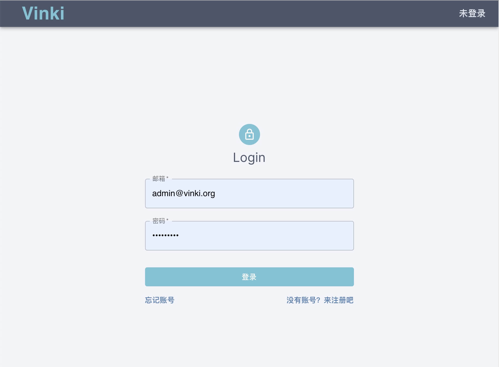
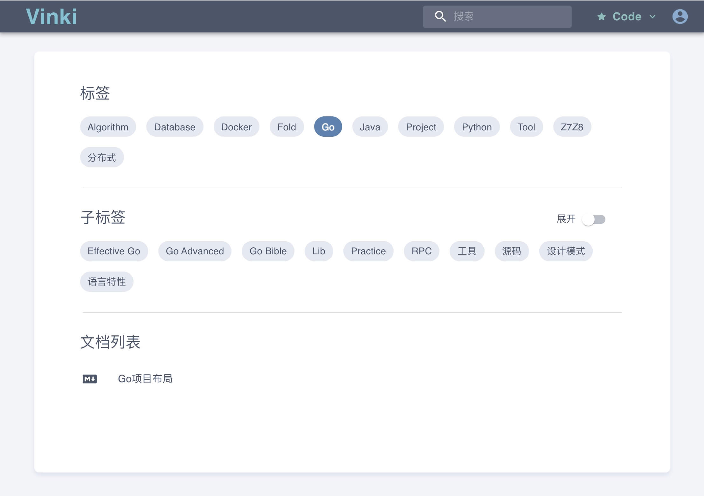
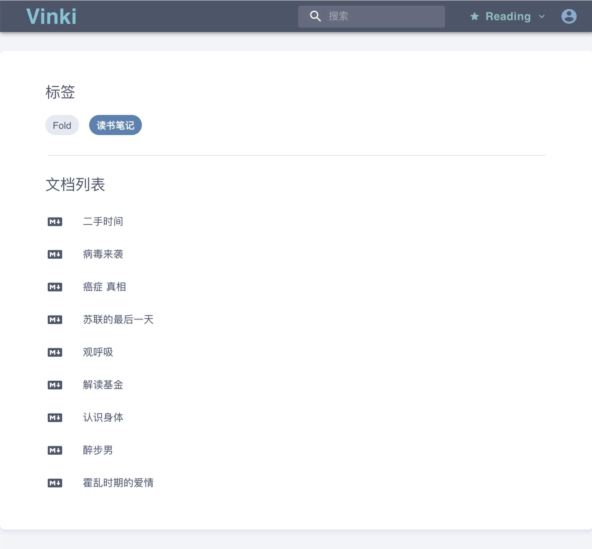
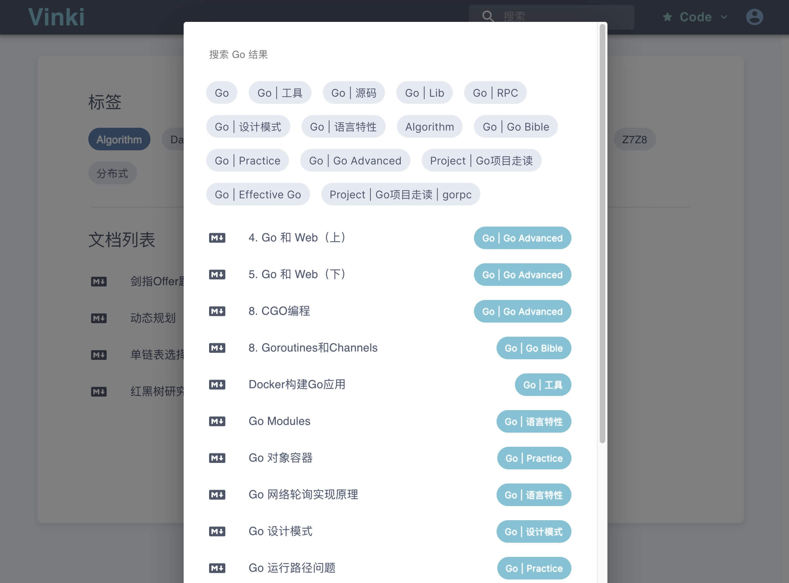
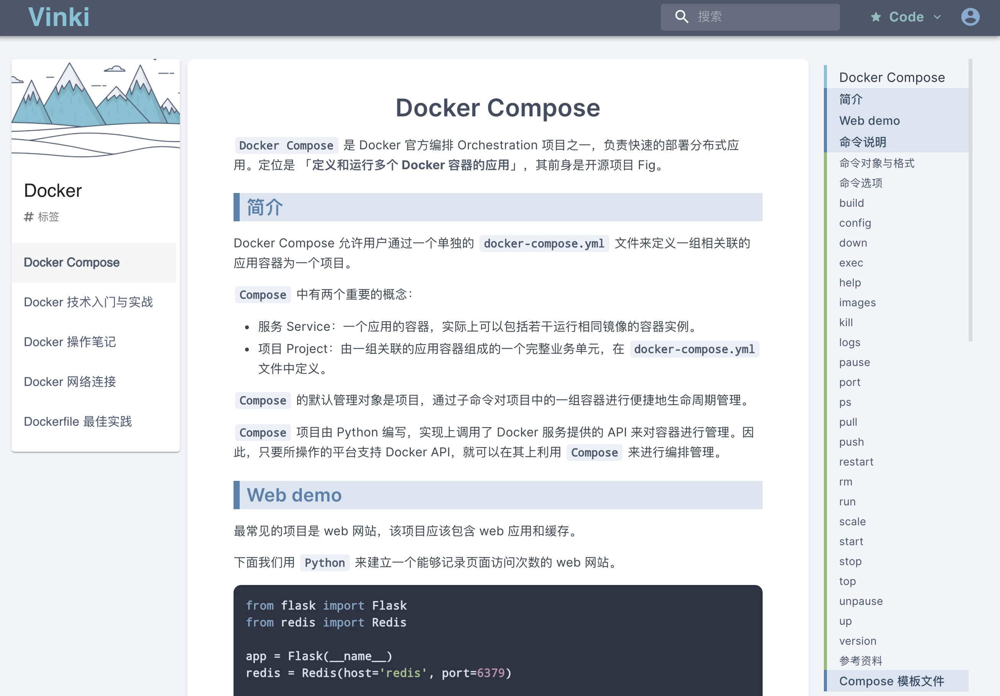

# Vinki

Vinki 是一款面向个人的轻量级 wiki 服务，用于快速预览和查询知识文档，有以下特点：

- **安全和便捷**。所有文档都由本地 Markdown 文件生成，文件都在本地，在安全性、可迁移性上都比「在线的第三方服务」更好。

- **高效地预览本地文档**。传统文件缺乏快速、便捷的查询和浏览方式，Vinki 旨在提供一种更优雅的方式利用自己的知识库。
- **无侵入**。Vinki 只负责文档的浏览、查询，不负责文档的编辑与管理，不对原始文件的组织形式做任何更改，用户只需要配置本地 Markdown 目录树的根路径，即可生成 wiki 仓库。

## Feature

- 多仓库切换
- 灵活选择多级标签
- 标签、文档搜索
- 文档预览：同标签文档列表、TOC 跳转
- 权限控制











## Philosophy

> Vinki 源自 Wiki（维基），结合了漫画「冰海战记」[Vinland Saga](https://en.wikipedia.org/wiki/Vinland_Saga_(manga)) 的名称。
>
> UI 也是来自北欧的 [Nord](https://www.nordtheme.com/) 配色，旨在提供简洁愉快的阅读体验。

## Else

> 注：目前由于 Markdown 渲染库不完善，文件中仅支持星号 `*` 作为 emphasis 斜体，`_` 下划线无作用。

## Usage

```bash
# build
./build.sh -b

# run
./vinki -c ~/.vinki/config.yml
```

配置文件示例：

```yaml
# ~/.vinki/config.yml
system:
  debug: false
  port: 6167

repositories:
  - root: "~/Cloudz/Notes/Code"
    exclude:
      - "Effective Java"
  - root: "~/louisun/Cloudz/Notes/Reading"
  - root: "~/louisun/Cloudz/Notes/Life"
    exclude:
      - "Fold" 
```

上面配置了 3 个仓库的路径（包括要排除的文件或目录名），服务端口为 `6167`。

> 第一次使用请用下面的**管理员账号**登录，并尝试点击「**更新仓库**」以初始化仓库数据。

```properties
# default admin
admin: admin@vinki.org
password: vinkipass
```

### Docker

> 若使用 Docker 运行服务，主要变动是配置文件。

**一、制作镜像**

直接从仓库拉取作者的镜像：

```bash
docker pull louisun/vinki:latest
```

本地构建：

```bash
docker build -t louisun/vinki .
```

**二、创建配置**

> 在 Docker 环境下，**需要映射目录到容器中**：
>
> - 容器中的服务默认读取的配置文件为`/vinki/conf/config.yaml`，因此要将配置文件映射到该路径；
> - 建议**将所有仓库目录放到同一个目录下**，再结合 `config.yaml` 映射到容器目录。

下面的有 3 个仓库 `仓库A`、`仓库B` 和 `仓库C`，统一放在宿主机 `/Users/dog/vinki` 目录下：

```bash
vinki
├── 仓库A
├── 仓库B
└── 仓库C
```

下面会映射上述目录至容器中的目录，推荐为 `/vinki/repository`。

假如本机配置放在 `/Users/dog/.vinki/conf/config.yaml` 中， 需要做如下的配置：

```yaml
system:
  debug: false
  port: 6166

repositories:
  - root: "/vinki/repository/仓库A"
  - root: "/vinki/repository/仓库B"
  - root: "/vinki/repository/仓库C"
      exclude:
        - "排除目录名"
        - "排除文件名"
```

**三、启动容器**：

```bash
docker run -d --name vinki -p 6166:6166 \
	-v /Users/dog/vinki:/vinki/repository \
	-v /Users/dog/.vinki/conf:/vinki/conf \
	louisun/vinki:latest
```
